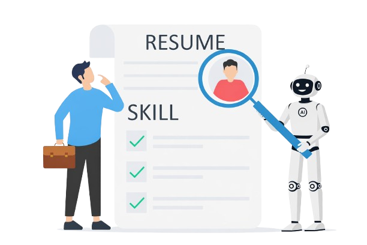
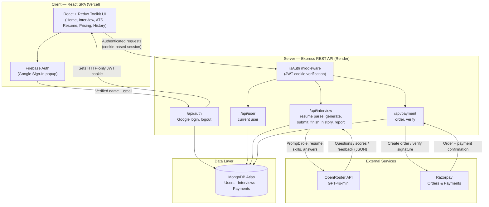

<div align="center">



# Elevo

### AI-Powered Interview Preparation Platform

Practice role-specific mock interviews, get instant AI-scored feedback, and optimize your resume for ATS — all in one place.

[](https://elevo-interview.vercel.app/)


</div>

---

## Table of Contents

- [About the Project](#about-the-project)
- [Key Features](#key-features)
- [Tech Stack](#tech-stack)
- [System Architecture](#system-architecture)
- [Project Structure](#project-structure)
- [API Reference](#api-reference)
- [Getting Started](#getting-started)
- [Environment Variables](#environment-variables)
- [Roadmap](#roadmap)
- [Author](#author)
- [License](#license)

---

## About the Project

**Elevo** is a full-stack MERN application that turns interview preparation into a structured, measurable process. Instead of generic question banks, Elevo generates **role-specific mock interviews with adaptive difficulty**, times each response like a real interview, and uses an LLM to score answers on **confidence, communication, and correctness** — then rolls those scores up into a detailed performance report.

The platform also includes a standalone **ATS Resume Analyzer** that scores an uploaded resume against a target role/job description and can export a re-optimized version of the resume as a PDF.

Elevo is built as a decoupled client/server application — a React SPA (deployed on Vercel) communicating with an Express REST API (deployed on Render), backed by MongoDB Atlas.

**Live application:** https://elevo-interview.vercel.app/

## Key Features

- **Google Sign-In** — one-click authentication via Firebase Auth, backed by an HTTP-only JWT session cookie issued by the API.
- **AI-Generated Mock Interviews** — GPT-4o-mini (via OpenRouter) generates 5 questions per session in **HR** or **Technical** mode, with difficulty that progresses from easy → medium → hard.
- **Resume-Aware Question Generation** — candidates can feed their role, experience level, skills, and parsed resume text into the prompt so questions reflect their actual background.
- **Timed Answering** — each question carries its own time limit (60s / 90s / 120s based on difficulty); answers submitted late are automatically scored zero.
- **AI Evaluation Engine** — every answer is scored 0–10 on confidence, communication, and correctness, with short human-style feedback generated per answer.
- **Performance Reports** — a final report aggregates per-question scores into an overall score and category-wise averages, viewable any time from interview history.
- **Interview History** — every session (role, mode, experience, final score, status) is persisted per user and retrievable later.
- **ATS Resume Analyzer** — upload a PDF resume, get an ATS match score against a target role/job description, and download an optimized resume as a PDF (parsing via `pdf.js`, export via `jsPDF`).
- **Credits & Paid Plans** — every action consumes credits; users can top up via **Razorpay**, with server-side signature verification before credits are added.
- **Editorial Design System** — a custom flat "Elevo editorial" visual identity (cream / charcoal / warm-brown palette, `Libre Caslon Text` serif headings) applied consistently across the app.

## Tech Stack

| Layer | Technology |
|---|---|
| **Frontend** | React 19, React Router, Redux Toolkit, Tailwind CSS 4, Motion (Framer Motion), Recharts, react-circular-progressbar, Vite |
| **Backend** | Node.js, Express 5, Mongoose (MongoDB) |
| **Auth** | Firebase Authentication (Google provider) + JWT session cookies |
| **AI / LLM** | OpenRouter API (`openai/gpt-4o-mini`) for question generation, resume parsing, and answer scoring |
| **Payments** | Razorpay (order creation + HMAC signature verification) |
| **File Handling** | Multer (uploads), `pdfjs-dist` (resume text extraction), `jsPDF` (resume/report export) |
| **Deployment** | Vercel (client), Render (server), MongoDB Atlas (database) |

## System Architecture



**Request flow in short:** the client authenticates with Firebase, hands the verified profile to the API which issues a JWT cookie; every subsequent call rides on that cookie through the `isAuth` middleware; the interview routes call out to OpenRouter for question generation and answer scoring, while the payment routes call out to Razorpay for credit top-ups — all state (users, interviews, payments) is persisted in MongoDB.

## Project Structure

```
Elevo/
├── client/                      # React (Vite) frontend
│   ├── src/
│   │   ├── components/          # Navbar, Footer, Auth modal, interview steps, timer
│   │   ├── pages/                # Home, Auth, InterviewPage, InterviewHistory,
│   │   │                         # InterviewReport, Atsresume, Pricing
│   │   ├── redux/                # Redux Toolkit store + user slice
│   │   └── utils/firebase.js     # Firebase Auth config
│   └── vite.config.js
│
└── server/                      # Express REST API
    ├── config/                   # DB connection, JWT token helper
    ├── controllers/              # auth, user, interview, payment logic
    ├── middlewares/               # isAuth (JWT guard), multer (uploads)
    ├── models/                    # User, Interview, Payment (Mongoose schemas)
    ├── routes/                    # /auth, /user, /interview, /payment
    ├── services/                  # OpenRouter (AI) + Razorpay clients
    └── index.js                   # App entry point
```

## API Reference

All authenticated routes read a JWT from an HTTP-only cookie set at login.

| Method | Endpoint | Auth | Description |
|---|---|:---:|---|
| `POST` | `/api/auth/google` | – | Create/find user from Google profile, set session cookie |
| `GET` | `/api/auth/logout` | – | Clear session cookie |
| `GET` | `/api/user/current-user` | ✅ | Fetch the logged-in user's profile |
| `POST` | `/api/interview/resume` | ✅ | Upload & parse a resume (PDF → structured JSON) |
| `POST` | `/api/interview/generate-questions` | ✅ | Generate a 5-question interview (deducts credits) |
| `POST` | `/api/interview/submit-answer` | ✅ | Submit and AI-score one answer |
| `POST` | `/api/interview/finish` | ✅ | Finalize the interview and compute the aggregate score |
| `GET` | `/api/interview/get-interview` | ✅ | List the current user's past interviews |
| `GET` | `/api/interview/report/:id` | ✅ | Fetch the full report for one interview |
| `POST` | `/api/payment/order` | ✅ | Create a Razorpay order for a credits plan |
| `POST` | `/api/payment/verify` | ✅ | Verify Razorpay signature and credit the user's account |

## Getting Started

### Prerequisites

- Node.js 18+
- A MongoDB connection string (e.g. from MongoDB Atlas)
- A Firebase project with Google sign-in enabled
- An OpenRouter API key
- A Razorpay account (test keys are sufficient for local development)

### 1. Clone the repository

```bash
git clone https://github.com/HemanshuSonar/Elevo.git
cd Elevo
```

### 2. Set up the server

```bash
cd server
npm install
# create a .env file — see Environment Variables below
npm run dev
```

### 3. Set up the client

```bash
cd client
npm install
# create a .env file — see Environment Variables below
npm run dev
```

The client runs on Vite's default dev server; the server listens on the port defined in `PORT` (defaults to `6000`).

## Environment Variables

**`server/.env`**

| Variable | Description |
|---|---|
| `PORT` | Port the Express server listens on |
| `MONGODB_URL` | MongoDB connection string |
| `JWT_SECRET` | Secret used to sign session JWTs |
| `OPENROUTER_API_KEY` | API key for OpenRouter (GPT-4o-mini access) |
| `RAZORPAY_KEY_ID` | Razorpay key ID |
| `RAZORPAY_KEY_SECRET` | Razorpay key secret |

**`client/.env`**

| Variable | Description |
|---|---|
| `VITE_FIREBASE_APIKEY` | Firebase Web API key (Google Auth) |
| `VITE_RAZORPAY_KEY_ID` | Razorpay public key ID used to open the checkout widget |

> Update the API base URL exported from `client/src/App.jsx` (`ServerUrl`) if you are pointing the client at a local server instead of the deployed Render instance.

## Roadmap

- [ ] Voice-based interview mode
- [ ] Richer analytics on the performance report (trend over time across sessions)
- [ ] Expanded ATS resume feedback (keyword gap detail per section)

## Author

**Hemanshu Sonar**
GitHub: [@HemanshuSonar](https://github.com/HemanshuSonar)

## License

This repository does not currently declare a license. All rights are reserved by the author unless a license is added.
